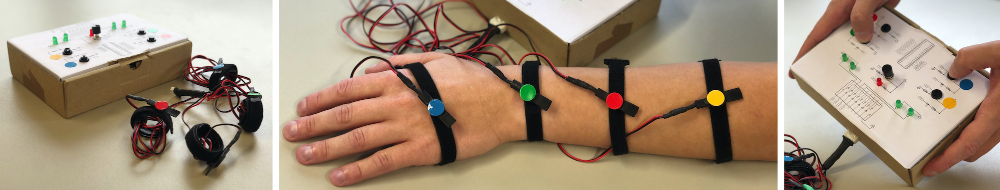

# TactJam
A collaborative playground for composing spatial tactons.


## How to contribute

Anyone with the passion for free software and hardware is welcome to contribute to this project by:

+ 👩‍💻 developing software
+ 🚀 designing hardware
+ 📝 writing tutorials or documentation in the [wiki](https://github.com/derikon/TactJam/wiki)
+ 👾 filing any [issues](https://github.com/derikon/TactJam/issues)  or suggesting new features
+ 🧑‍🏭 sending [pull requests](https://github.com/derikon/TactJam/pulls) for fixed bugs or implementation of new features


Before you start, please take a look at the project boards ([software](https://github.com/derikon/TactJam/projects/1), [hardware](https://github.com/derikon/TactJam/projects/2)) and the [issues](https://github.com/derikon/TactJam/issues). Maybe there is already a similar bug or feature request that is already under construction and may need your expertise and support.


### How to commit

To make contribution easier for everyone we like use a common structure of git commit messages: 

```
<type>[optional scope]: <description>
[optional body]
[optional footer(s)]
```

Please refer to [www.conventionalcommits.org](https://www.conventionalcommits.org/en/v1.0.0/) for more information.

