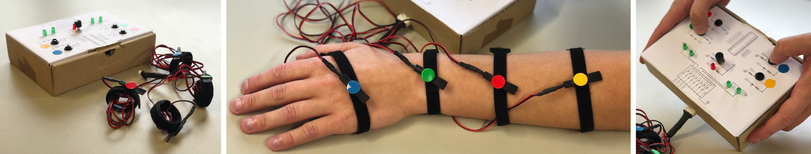

# About the Workshop

Tactons are vibrotactile patterns used to convey information. Conventionally, a small set of tactons is used on mobile phone or wearables to notify users of messages or emails received. However, tactons have multiple characteristics that one can vary to design a multitude of vibrotactile patterns. In addition, one can place vibrotactile actuators on different body areas to leverage the spatial dimension and the varying skin sensitivity across the body. Prior work proposed methods to design tactons based on musical or engineering knowledge, but hands-on methods remain scarce. For this studio, we adopt a hands-on approach for composing tactons. We leverage a simple instrument-like device that consists of vibrotactile actuators connected to dedicated buttons for designing tactons. While pressing a button, the corresponding actuator vibrates. Users can vary several characteristics of the tactons (e.g., duration and amplitude), and experience them in real time during the design process by placing the actuators on the body. These tactons can then be shared with other participants of the studio. Our goal with this studio is to observe users compose tactons collaboratively using a hands-on device, and better understand how they lay out the vibrotactile actuators on their body and what differences these layouts make in the tactile experience.

TactJam prototype: using a tangible interface, users can quickly design tactons while experiencing them on theirbody. 

# Important dates

- __Call out__: December 21st-22nd, 2020
- __Registration deadline__: we require early registrations to ship the physical devices in time
  - _non-EU participants_ January 15th, 2021
  - _EU participants_, January 31st, 2021 
- __Workshop date__: February 19th, 2021

You can find a detailed __schedule__ of the studio [here](studioSchedule).

# Call for participation

In this studio, we focus on designing vibrotactile patterns (tactons) for the whole body. These tactons enable conveying non-visual information to users that can be beneficial in many scenarios where overloading the user with visual information should be avoided (e.g., driving). While one can design tactons with various comprehensive tools, we adopt a more hands-on approach and propose to design them using an instrument-like device we call TactJam. Such a device is easy to master and does not require any knowledge in tactile feedback.

This studio is made for any person interested in designing tactons to be experienced on the whole body. We do not restrict applications from a certain population of the HCI community, but rather hope that many researchers or hobbyists from diverse backgrounds would attend.

The aim of this studio is to organize collaborative ideation sessions focused on the design of tactons. Using the TactJam devices, all attendees will be able to design and feel the tactons they came up with, but also from all others. We hope to generate discussions on various strategies to create such patterns, as well as ideal placement of the actuators on the body based on users’ sensibility.

By the end of the studio, attendees will know about tactons and their uses in general. They will have experienced and designed novel vibrotactile patterns using a simple instrument-like device, and would have shared their creative process with others. The authors will keep the library of tactons created and report the results of the ideation sessions on the studio’s website.

For any question regarding the workshop, please contact Dennis Wittchen at [dennis.wittchen@htw-dresden.de](mailto:dennis.wittchen@htw-dresden.de).

# Organizers
- __Dennis Wittchen__, University of Applied Sciences, Dresden, Germany - [dennis.wittchen@htw-dresden.de](mailto:dennis.wittchen@htw-dresden.de)
- __Bruno Fruchard__, Saarland University, Saarbrücken, Germany - [fruchard@cs.uni-saarland.de](mailto:fruchard@cs.uni-saarland.de)
- __Paul Strohmeier__, Saarland University, Saarbrücken, Germany - [strohmeier@cs.uni-saarland.de](mailto:strohmeier@cs.uni-saarland.de)
- __Georg Freitag__, University of Applied Sciences, Dresden, Germany - [georg.freitag@htw-dresden.de](mailto:georg.freitag@htw-dresden.de)
