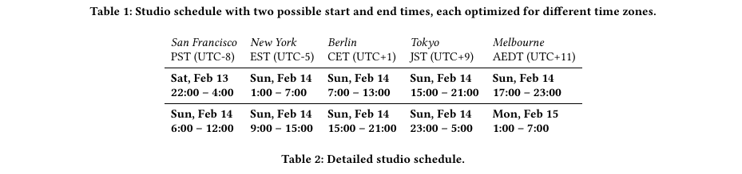
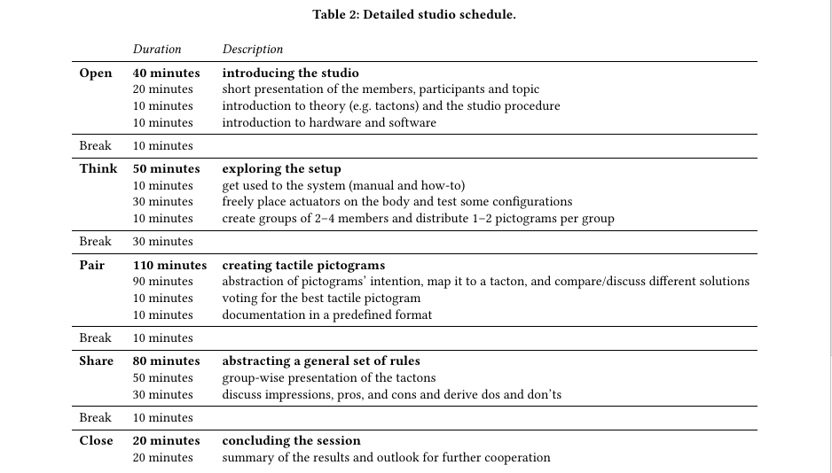

# STUDIO SUPPORTING RESOURCES
Each participant will get an assembled TactJam device. To ensure
that all equipment arrives on time worldwide, shipping will take
place no later than three weeks before the workshop. Additionally,
the authors provide a public accessible [Git repository](https://github.com/derikon/TactJam) where par-
ticipants get schematics and firmware code for the dev-kit to build
their own devices and are able to extend the hardware or software
according to their own ideas. The repository also hosts the studios’
website providing all important information, e.g. schedule, tuto-
rials, documentation and other supplementary materials. During
the studio participants can share and discuss ideas or artifacts on
a Discord server. This server will also be used for video calls and
online presentation via screen sharing.

